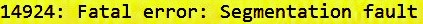
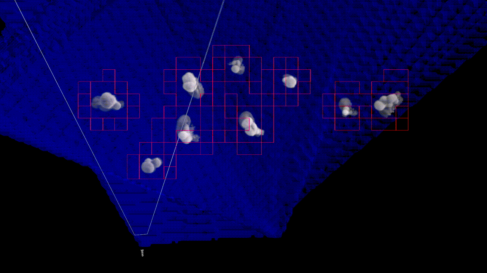
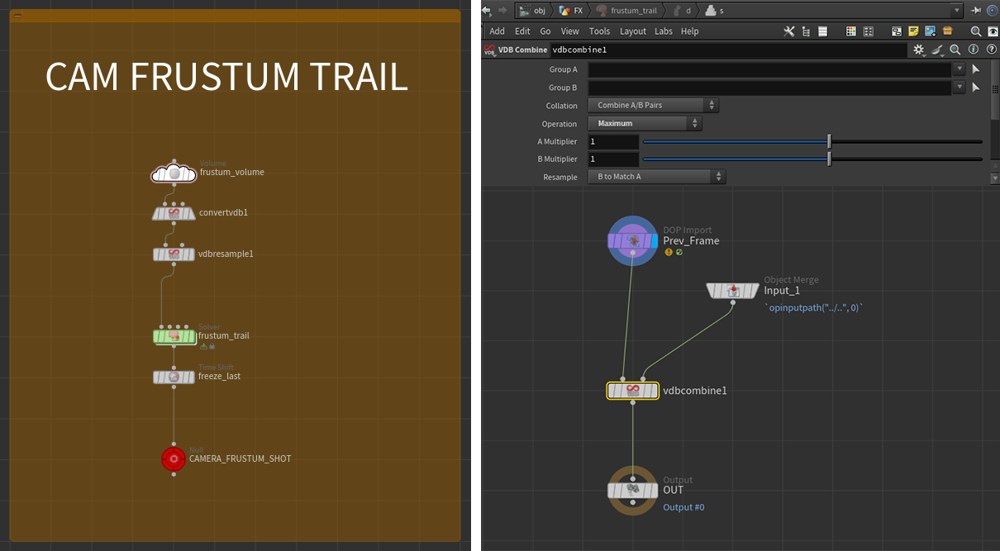

# Frustum cull simulations and moving cameras
When working on very heavy simulations you'll often get to the point of trying to optimize things to hopefully having them go through the farm without someone from system or production yelling at you, or your own workstation going  

 {width="100%"}

Besides wedging and clustering, a very common operation to perform in these situations is camera frustum culling at simulation time.  
Until here, nothing new. Depending on the solver you're using you might opt for a *toNDC-and-check-if-in-unit-cube* approach or a *volumesample-the-camera-frustum-volume*, you name it.  

What I'd like to talk about here, however, is a possible solution to deal with those shots where:

* the simulation needs to be calculated in areas that are not always framed by the camera, but that will eventually be, thus can't be simply camera culled (as this would result in the sim object not being there when you need it to);  
* we still want to get rid of things as soon as they get out of the camera view because they won't be framed again > optimization goes stonks. 📈

The perfect example use case would be a shot were the camera moves a lot, traveling a long distance. Since we're here, what if the camera turns back looking at what's left behind.  
Perfect situation where I'd personally be like "yeet it to the farm, hopefully a few more clusters will do this time".

## Houdini sample scene
I made a simple test scene in houdini so I can stop yapping and start showing instead.  
If you prefer to check it for yourself, here's the hipfile:

!!! abstract "Download houdini [hipfile](../assets/projectfiles/houdini/pyro_culling_trail.git_v001.hipnc)."

Imagine having to work on something like this(1): 
{ .annotate }

1.  now, imagine if this was also not looking like trash


The elements are:

* a bunch of ^~non-ILM-looking™~^ smoke plumes that need preroll before being framed
* a ~^non-ILM-looking-either™^~ explosion happening out of camera
* camera traveling a decent distance, then turning around

As I said before, I'd like to camera cull my sims as soon as they're not needed anymore (ie: left behind). 
There are a few ways to achieve what we're looking for.  

!!! example "Fedor's Take"
    For example, my dear deskmate Fedor Koleganov once showed me his approach for these kind of situations.  Starting from the current frame, trail the camera frustum forward until the end of the shot range. Make a VDB out of it for every frame. Then `volumesample` it at sim time: if the particle/voxel is outside, blast it/deactivate it > done!  
    Given a frame, trailing the camera frustum until the end of the shot returns an active area that covers everything that's going to be needed *"in the future"*, while excluding everything that's already *"gone"*. Pretty cool uh? 

While this is valid, since 80% of my time in the studio consists in arguing with him, I tried to come up with a non-time-dependent alternative.    
That is to say, I only want to load my culling data once and use that, instead of having to compute a different masking volume for each frame.  
If you couldn't care less, then go with the first approach, otherwise keep scrolling to see how we get to something like this:



## Camera frustum trail - `last_frame` utility volume

This solution will also use a camera frustum volume trail. 
To achieve what we're looking for though, we're not going to generate a simple 0-1 masking value. Instead, let's treat it as a utility grid where every voxel contains the last frame at which that portion of space was effectively "seen" by the camera.

To do it, we first generate a volume grid representing the camera frustum. The volume resolution can be quite low as this will simply act as a mask.  
We then assign the volume a density value of `$F`.  
Now, all the space seen by the camera at the current frame has a value equal to the current frame itself (*duh*).

!!!warning
    The volume will look like absolute garbage in the viewport, this is because the density value will likely be very high, unless your working with a [1; N] frame range. Which is not the case, right? Right.

We then want to trail the whole shot and keep the maximum Frame value for each voxel in space. This will effectively give us the last time a certain portion in space was last seen by the camera!

We do this by running the frustum volume through a sop solver. Inside the solver we simply compare the current frame and the previous one, using a `vdbcombine` we take the maximum value of each voxel.  
We can then freeze the result at `$FEND + 1` using a `timeshift`and cache that one single frame!
Congrats, you can now use this non-time-dependent cache to perform camera culling on any sim layer of your setup! 

Below you can find an implementation of what I just described. On the next paragraph we'll have a look at a few lines of vex to perform the culling inside a solver.

{: style="width:100%"}


??? quote "Node parameters"
    ``` json
    {
        "frustum_volume": {
            name: "last_frame",
            initial_val: "$F",
            dimensions: "From Camera",
            camera: "path/to/your/cam",
            zmin: 0.1,  //Use a meaningful value for your shot
            zmax: 20,   //Use a meaningful value for your shot
            winxmin: -0.1, winxmax: 1.1, //A touch of padding
            winymin: -0.1, winymax: 1.1, //A touch of padding
            uniformsamples: "By Size",
            divsize: 0.5
        },

        "convertvdb1": {
            conversion: "VDB",
            bdbtype: "Integer"
        },

        "vdbresample1": {
            order: "Nearest",
            mode: "Using Voxel Size Only",
            voxelsize: 0.2,
            linearxform: True //Force Axis Aligned! This is very important, VDB combine will act weird otherwise! 
        },

        "frustum_trail": {
            startframe: 950 //Your camera range start, include preroll if needed for downstream
        }

        "freeze_last": {
            frame: "$FEND + 1" //End of your shot, plus one to avoid disappearing stuff on the last frame
        }
    }

    ```


## Culling - Inside the dopnet

At this point everything is ready, now depending on what you're simulating follow these steps!

### Pyro simulation

Create a gasfieldwrangle
``` c linenums="1" title="Solver Gas Field Wrangle"
float last_frame = volumesample(1, 0, v@P);

if(@Frame > last_frame){
    f@density = 0;
    f@flame = 0;
    f@temperature = 0;
    // fields to be set to 0, don't do it with vel unless you want the bounds to act like a collider
}
```

### Particle simulation (also RBD and vellum)